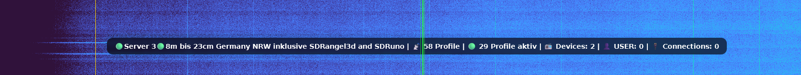

# DNX-Statusbar

Movable DNX Runtime Frontend Extension for OpenWebRX+

## Features

- Draggable floating statusbar
- Persistent position (localStorage)
- Live receiver statistics
- Lightweight runtime extension
- No OpenWebRX core modifications
- Easy install / uninstall
- Portable across OpenWebRX instances

## Install
## Install

Clone repository:

git clone https://github.com/KanotixPinguin/DNX-Statusbar.git

Enter directory:

cd DNX-Statusbar

Make scripts executable:

chmod +x install.sh uninstall.sh

Run installer:

./install.sh

Installer automatically detects OpenWebRX containers.

Example:

1) owrx-8010
2) owrx-8011
3) owrx-8015

Select container number:

After installation:
Hard reload browser with:

CTRL + SHIFT + R

bash install.sh <container-name>

Examples:

- bash install.sh owrx-8010
- bash install.sh owrx-8011
- bash install.sh owrx-8015

## Remove

## Remove

./uninstall.sh

## Notes

- Works with multiple OpenWebRX containers
- No OpenWebRX core modifications
- Runtime frontend extension only
- Position stored in browser localStorage

bash uninstall.sh <container-name>

Examples:

- bash uninstall.sh owrx-8010
- bash uninstall.sh owrx-8011
- bash uninstall.sh owrx-8015

## Runtime Features

- Receiver Name
- Profiles
- Active Profiles
- Devices
- Online / Offline
- USER
- Connections

## Notes

This is a DNX frontend runtime extension.
It does not modify OpenWebRX DSP or backend core functionality.
